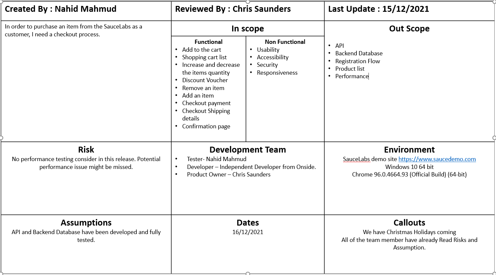
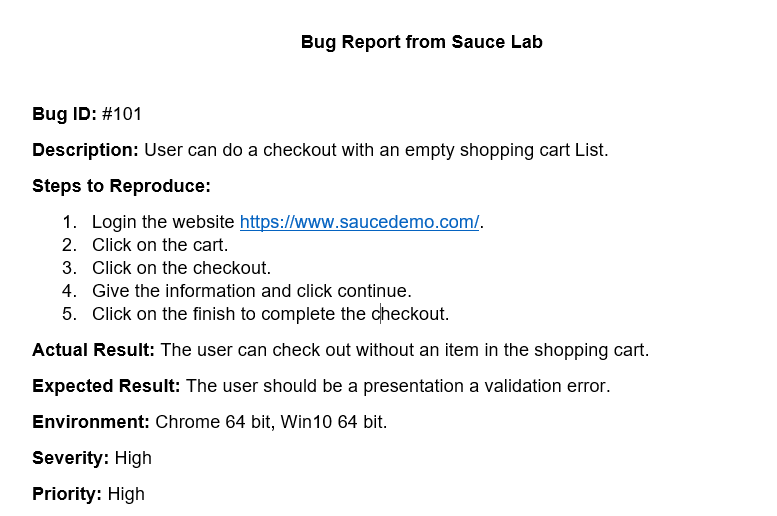
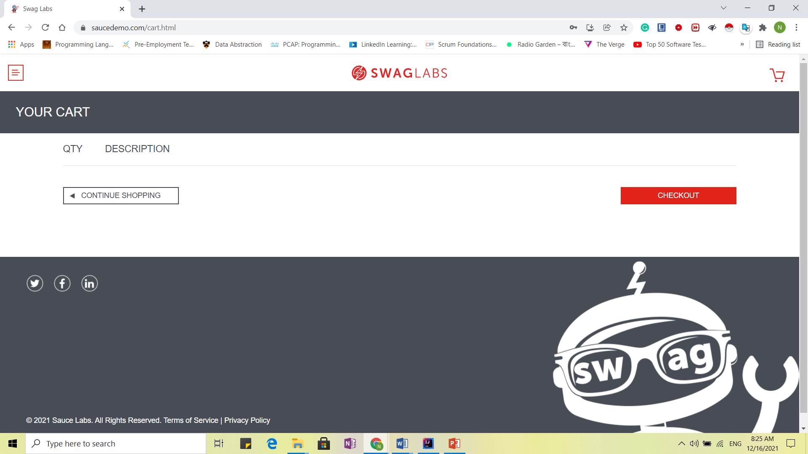
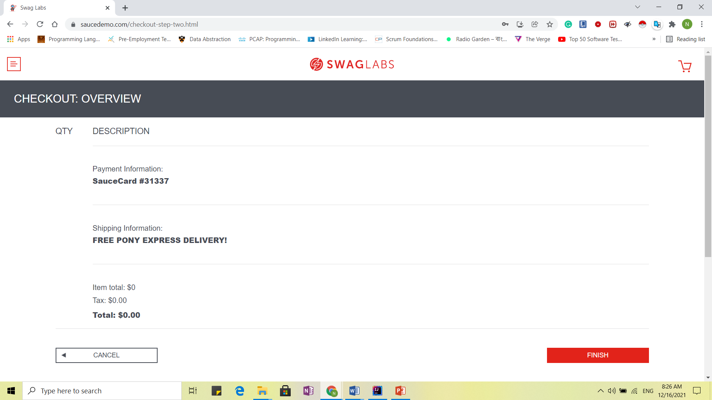
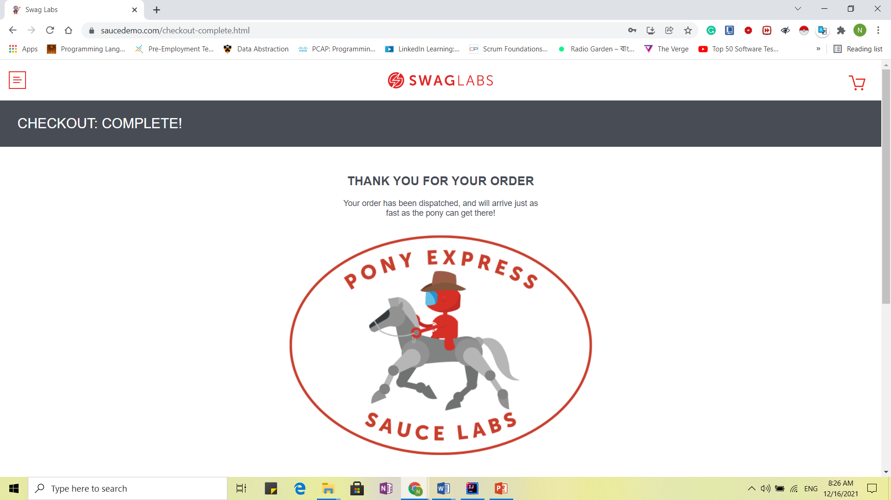

# Onside Technical Test
##Introduction
The following document contains test plan, automation execution steps and defect reporting of the Saucelabs demo website.

##Test Plan (30 min)

##Test Automation (15 min)
### Step 1: Clone this Repo 
> git clone https://github.com/nahidmahmudqa/OnsideTechnicalTest.git
### Step 2: Open Project on IntelliJ
### Step 3: Build project and dependencies
### Step 4: Run Test

### Bug Report(15 min)

### Bug Screenshots:

